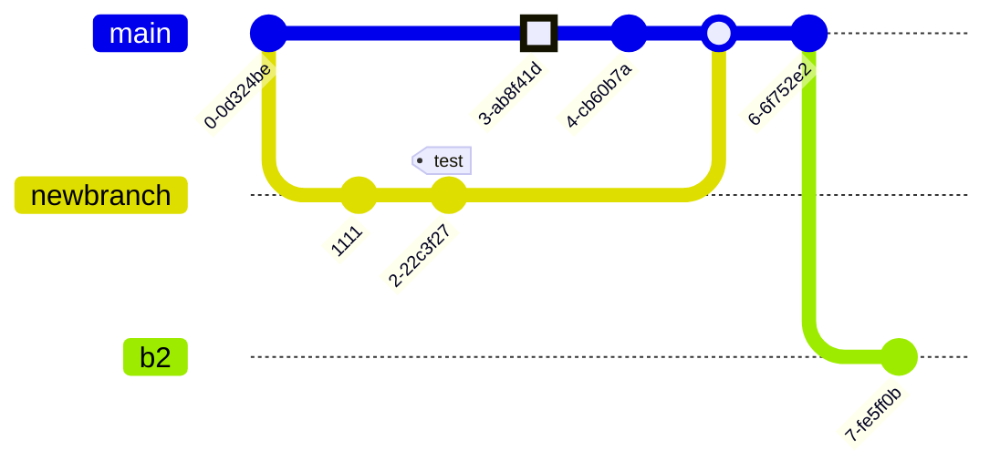

+++
date = '2025-07-31T10:51:01+09:00'
draft = false
title = 'Mermaid'
tag = ['mermaid', 'diagram', 'visualization']
slug = 'mermaid-example'
+++

### 1\. フローチャート (Flowchart)


graph TD
    A[Start] --> B{Choice};
    B -- Yes --> C[Process 1];
    B -- No --> D[Process 2];
    C --> E[End];
    D --> E;


-----

### 2\. シーケンス図 (Sequence Diagram)


sequenceDiagram;
    participant Alice
    participant Bob
    Alice->>Bob: Hello Bob, how are you?
    Bob-->>Alice: I am good thanks!
    Alice->>Bob: See you later.


-----

### 3\. ガントチャート (Gantt Chart)


gantt
    dateFormat  YYYY-MM-DD
    title Project Schedule
    section Design
    Requirements Definition     :a1, 2024-01-02, 1M
    System Design  :a2, after a1, 5d
    section Development
    Frontend :b1, after a2, 10d
    Backend   :b2, after a2, 12d
    section Testing
    Unit Testing    :c1, after b1, 5d
    Integration Testing    :c2, after b2, 7d


-----

### 4\. クラス図 (Class Diagram)

-----

### 5\. ステート図 (State Diagram)

システムやオブジェクトの状態とその遷移を表現します。


stateDiagram-v2
    [*] --> Off
    Off --> On : turn on
    On --> Off : turn off
    On --> Sleep : sleep
    Sleep --> On : wake up
    Sleep --> Off : turn off


-----

### 6\. ユーザー旅程図 (User Journey Diagram)


journey
    title My working day
    section Go to work
      Make tea: 5: Me
      Go upstairs: 3: Me
      Do work: 1: Me, Cat
    section Go home
      Go downstairs: 5: Me
      Sit down: 5: Me


-----

### 7\. エンティティ関係図 (ER Diagram)


erDiagram
    CUSTOMER ||--o{ ORDER : places
    ORDER ||--|{ LINE-ITEM : contains
    PRODUCT }|--o{ LINE-ITEM : includes
    CUSTOMER }|..|{ ADDRESS : lives in


### 8\. Git Graph


gitGraph:
    commit "Ashish"
    branch newbranch
    checkout newbranch
    commit id:"1111"
    commit tag:"test"
    checkout main
    commit type: HIGHLIGHT
    commit
    merge newbranch
    commit
    branch b2
    commit


### 9\. Mind Map


mindmap
  root((mindmap))
    Origins
      Long history
      Popularisation
        British popular psychology author Tony Buzan
    Research
      On effectiveness and features
      On Automatic creation
        Uses
            Creative techniques
            Strategic planning
            Argument mapping
    Tools
      Pen and paper
      Mermaid

